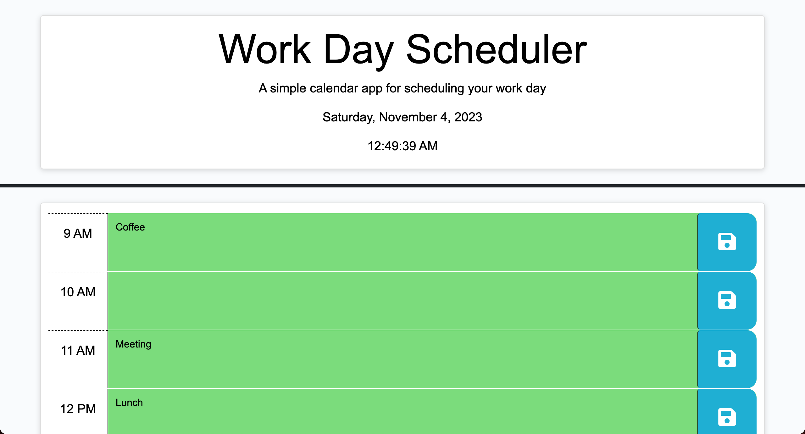

# Work Day Scheduler
This application is a simple day planner designed to help employees with busy schedules manage their time effectively. It allows users to add important events to their daily planner for each hour of a typical working day, which spans from 9:00 am to 5:00 pm. The application runs in the browser and features dynamically updated HTML and CSS powered by jQuery. It utilizes the Day.js library to work with date and time.

The purpose of this application is to provide a user-friendly digital tool for individuals with packed schedules to organize and keep track of their daily tasks and appointments. It offers an easy and efficient way to plan, update, and save events throughout the workday.

Users can open the planner, where they will see the current day displayed at the top of the calendar. As they scroll down, time blocks for standard business hours are presented, color-coded to indicate whether each time block is in the past, present, or future. Users can click into a time block to enter an event and save it by clicking the save button for that time block. The entered event text is stored in local storage, ensuring that saved events persist even after the page is refreshed.

## Usage
> [Link to deployed application](https://kyoriku.github.io/work-day-scheduler/)

## Credits
- [Day.js - Hour](https://day.js.org/docs/en/get-set/hour)
- [Day.js - Format](https://day.js.org/docs/en/display/format)
- [jQuery - .each()](https://api.jquery.com/each/)
- [jQuery - .attr()](https://api.jquery.com/attr/)
- [jQuery - .data()](https://api.jquery.com/data/)
- [jQuery - .removeClass()](https://api.jquery.com/removeClass/)
- [jQuery - .addClass()](https://api.jquery.com/addClass/)
- [jQuery - .on()](https://api.jquery.com/on/)
- [jQuery - .parent()](https://api.jquery.com/parent/)
- [jQuery - .siblings()](https://api.jquery.com/siblings/)
- [jQuery - .children()](https://api.jquery.com/children/)
- [jQuery - .val()](https://api.jquery.com/val/)
- [MDN - setItem()](https://developer.mozilla.org/en-US/docs/Web/API/Storage/setItem)
- [MDN - getItem()](https://developer.mozilla.org/en-US/docs/Web/API/Storage/getItem)
- [MDN - parseInt()](https://developer.mozilla.org/en-US/docs/Web/JavaScript/Reference/Global_Objects/parseInt)
- [MDN - setInterval()](https://developer.mozilla.org/en-US/docs/Web/API/setInterval)

## License
Please refer to the LICENSE in the repo.